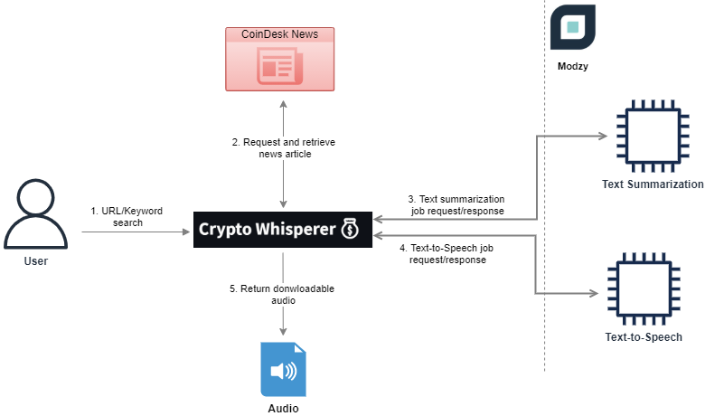

# CryptoWhisperer

An application that retrieves the latest crypto news from [CoinDesk](https://www.coindesk.com/) by performing a keyword-based or URL-based search query. Then, it returns downloadable vocal summaries of the news.

## Demo

Youtube: [watch](https://youtu.be/8YNNACps7Yo)

Try it out: [share.streamlit.io](https://share.streamlit.io/ivanlaulintiong/cryptowhisperer/main/app.py)

## Workflow



## Setup Instructions

1. Clone the repository to local machine
2. Install python version >=3.6 and all required python packages in requirements.txt
3. Create a folder called `chromedriver` and download chromedriver from [here](https://chromedriver.chromium.org/downloads). Extract `chromedriver.exe` from downloaded zip to `chromedriver` folder.
4. Create a folder called `.streamlit` and add a file called `secrets.toml`. Add your Modzy API key at this file as shown below:

```console
API_KEY = "YOUR_MODZY_API_KEY"`
```

5. Go to `backend\backend.py` uncomment line 91 and comment line 92 for local running as shown below (conversely revert those lines for deployment):

```python
    91    with webdriver.Chrome(CHROMEDRIVER_LOCATION, options=options) as driver: # for local dev
    92    # with webdriver.Chrome(options=options) as driver:                          # for deploy
```

6. Open terminal and run command below to launch app which is running on `http://localhost:8501` by default:

```console
streamlit run app.py
```

## Files Description

- `app.py`
  - streamlit frontend application

- `backend\backend.py`
  - backend logic for processing user input search via Modzy SDK and selenium package

- `crypto_whisperer_prototype.ipynb`
  - notebook for experimenting Modzy API and SDK
- `chromedriver\chromedriver.exe`
  - toolkit for selenium special needs in order to manipulate chrome

- `packages.txt`
  - for purpose of attaching along with the app when deploying to streamlit platfrom, which helps installing chrome and chromedriver on streamlit instance

## Future Improvement

- add audio autoplay feature to the app
- improve the execution speed for backend especially for keyword-based search
- build a lightweight chrome extension version for this app
- extend "whisper" to other famous crypto sites (etc. reddit, CoinTelegraph)
